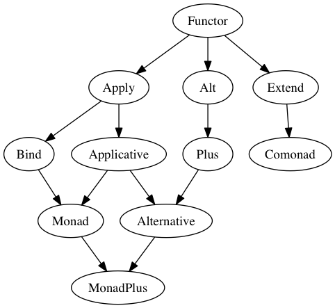

# Typeclass hierarchy

 
 

# Common Functions and Operators

| Context     | Module                | Min? | Prefix                         | Infix | Prec | Signature                                        |
| ----------- | --------------------- | ---- | ------------------------------ | ----- | ---- | ------------------------------------------------ |
| _none_      | `Data.Function`       |      |                                |       |      |                                                  |
|             |                       | N/A  | `apply`                        | `$`   | R0   | `(a -> b) -> a -> b`                             |
|             |                       | N/A  | `applyFlipped`                 | `#`   | L1   | `a -> (a -> b) -> b`                             |
|             |                       | N/A  | `compose`                      | `<<<` | R9   | `(b -> c) -> (a -> b) -> a -> c`                 |
|             |                       | N/A  | `composeFlipped`               | `>>>` | R9   | `(a -> b) -> (b -> c) -> a -> c`                 |
| Functor     | `Data.Functor`        |      |                                |       |      |                                                  |
|             |                       | +    | `map`                          | `<$>` | L4   | `Functor f => (a -> b) -> f a -> f b`            |
|             |                       | -    | `mapFlipped`                   | `<#>` | L1   | `Functor f => f a -> (a -> b) -> f b`            |
| Apply       | `Control.Apply`       |      |                                |       |      |                                                  |
|             |                       | +    | `apply`                        | `<*>` | L4   | `Apply f => f (a -> b) -> f a -> f b`            |
| Applicative | `Control.Applicative` |      |                                |       |      |                                                  |
|             |                       | +    | `pure`                         | N/A   | N/A  | `Applicative a => a -> f a`                      |
| Bind        | `Control.Bind`        |      |                                |       |      |                                                  |
|             |                       | +    | `bind`                         | `>>=` | L1   | `Bind m => m a -> (a -> m b) -> m b`             |
|             |                       | -    | `bindFlipped`                  | `=<<` | R1   | `Bind m => (a -> m b) -> m a -> m b`             |
|             |                       | -    | `composeKleisli`               | `>=>` | R1   | `Bind m => (a -> m b) -> (b -> m c) -> a -> m c` |
|             |                       | -    | `composecomposeKleisliFlipped` | `<=<` | R1   | `Bind m => (b -> m c) -> (a -> m b) -> a -> m c` |

# Language Constructs

function application:
`f 1`

record update: `someRecord { a = 1, b = 2 }`
